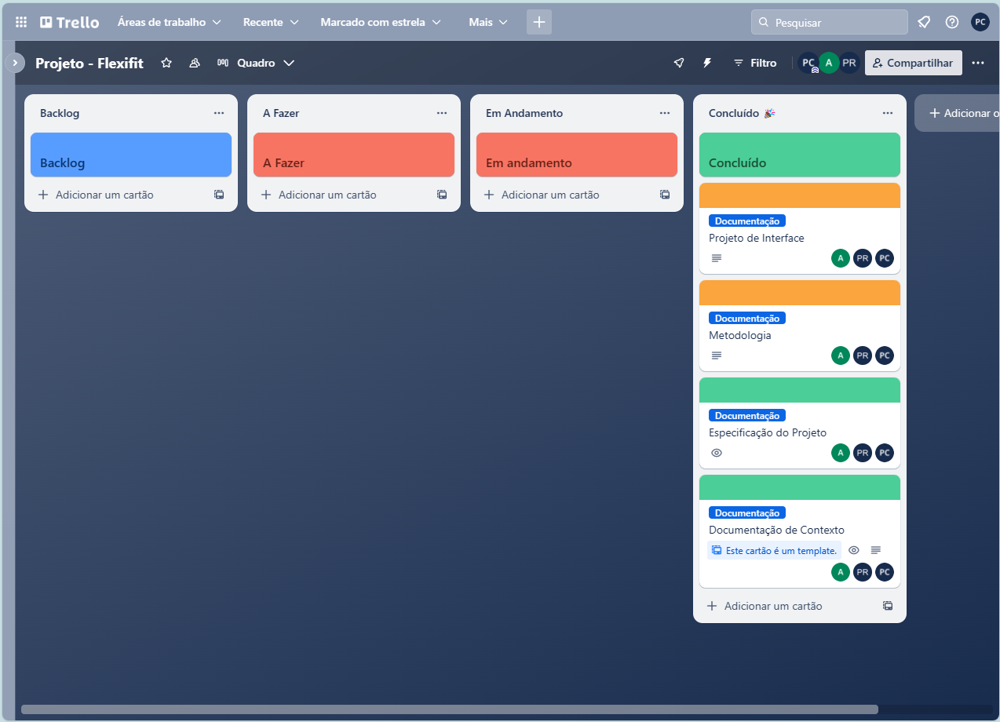
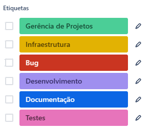

# Metodologia

Esta seção descreve a organização da equipe para a execução das tarefas do projeto e as ferramentas utilizadas para a manutenção dos códigos e demais artefatos.

## Gerenciamento de Projeto
A metodologia ágil escolhida para o desenvolvimento deste projeto foi o SCRUM, pois como citam Amaral, Fleury e Isoni (2019, p. 68), seus benefícios são a

“visão clara dos resultados a entregar; ritmo e disciplina necessários à execução; definição de papéis e responsabilidades dos integrantes do projeto (Scrum Owner, Scrum Master e Team); empoderamento dos membros da equipe de projetos para atingir o desafio; conhecimento distribuído e compartilhado de forma colaborativa; ambiência favorável para crítica às ideias e não às pessoas.”

### Divisão de Papéis

A equipe utiliza o Scrum como base para definição do processo de desenvolvimento.

- Scrum Master: Pedro Francis Maia Ceolho
- Product Owner: Marina Dionysio Mariano
- Equipe de Desenvolvimento: Pablo Rangel Nascimento Lima, Pedro Henrique Chaves
- Equipe de Design: Felipe Ferreira Machado, Sergio Gonçalves da Silva Junior

### Processo

Para organização e distribuição das tarefas do projeto, a equipe está utilizando o Trello, estruturado com as seguintes listas:

- Backlog: recebe as tarefas a serem trabalhadas e representa o Product Backlog. Todas as atividades identificadas no decorrer do projeto também devem ser incorporadas a esta lista. 
- A Fazer: Esta lista representa o Sprint Backlog. Este é o Sprint atual que estamos trabalhando. 
- Em Andamento: Quando uma tarefa tiver sido iniciada, ela é movida para cá. 
- Concluído: nesta lista são colocadas as tarefas que passaram pelos testes e controle de qualidade e estão prontos para ser entregues ao usuário. Não há mais edições ou revisões necessárias, ele está agendado e pronto para a ação.

O quadro kanban do grupo no Trello está disponível no link https://trello.com/b/hxjuL31x/projeto-flexifit e é apresentado, no estado atual, na figura abaixo:

<figure> 
  Figura 1 - Kanban - Projeto - Flexifit</figcaption>
</figure> 

### Etiquetas

As tarefas são, ainda, etiquetadas em função da natureza da atividade e seguem o seguinte esquema de cores/categorias:

<ul>
  <li>Bug (Erro no código)</li>
  <li>Desenvolvimento)</li>
  <li>Documentação</li>
  <li>Gerência de Projetos)</li>
  <li>Infraestrutura</li>
  <li>Testes</li>
</ul>

<figure> 
  Figura 2 - Tela do esquema de cores e categorias</figcaption>
</figure> 
  
### Ferramentas

[Descreva aqui as ferramentas empregadas no projeto e os ambiente de trabalho utilizados pela  equipe para desenvolvê-lo. Abrange a relação de ambientes utilizados, a estrutura para gestão do código fonte, além da definição do processo e ferramenta através dos quais a equipe se organiza (Gestão de Times).]

Os artefatos do projeto são desenvolvidos a partir de diversas plataformas e a relação dos ambientes com seu respectivo propósito é apresentada na tabela que se segue.

| AMBIENTE                            | PLATAFORMA                         | LINK DE ACESSO                         |
|-------------------------------------|------------------------------------|----------------------------------------|
| Repositório de código fonte         | GitHub                             | https://github.com/ICEI-PUC-Minas-PMV-ADS/pmv-ads-2023-2-e1-proj-web-t3-grupo-01/tree/main/codigo-fonte |
| Documentos do projeto               | GitHub                             | https://github.com/ICEI-PUC-Minas-PMV-ADS/pmv-ads-2023-2-e1-proj-web-t3-grupo-01/tree/main/documentos |
| Projeto de Interface                | Figma                              | https://www.figma.com/file/wAKx1s0sbXuWETPymZyRJO/Untitled?type=design&node-id=2%3A7&mode=design&t=TS79o4AamIFhlfC4-1 |
| Gerenciamento do Projeto            | GitHub Projects                    | https://trello.com/b/hxjuL31x/projeto-flexifit |

### Estratégia de Organização de Codificação 

Todos os artefatos relacionados a implementação e visualização dos conteúdos do projeto do site deverão ser inseridos na pasta [codigo-fonte](https://github.com/ICEI-PUC-Minas-PMV-ADS/pmv-ads-2023-2-e1-proj-web-t3-grupo-01/tree/main/codigo-fonte). Consulte também a nossa sugestão referente a estratégia de organização de codificação a ser adotada pela equipe de desenvolvimento do projeto.
