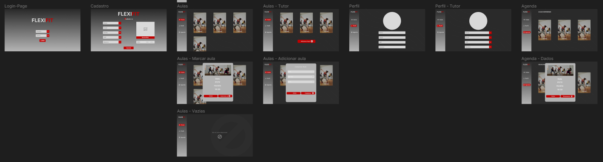
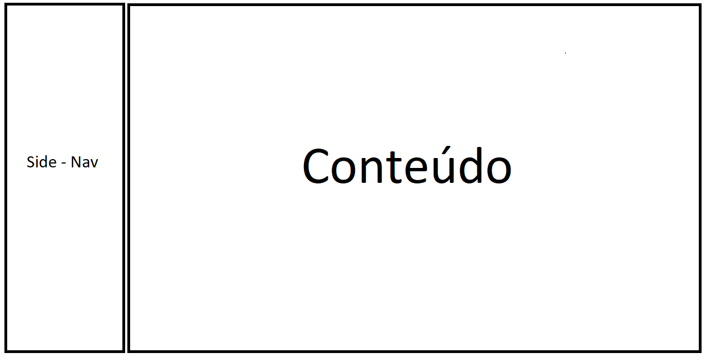
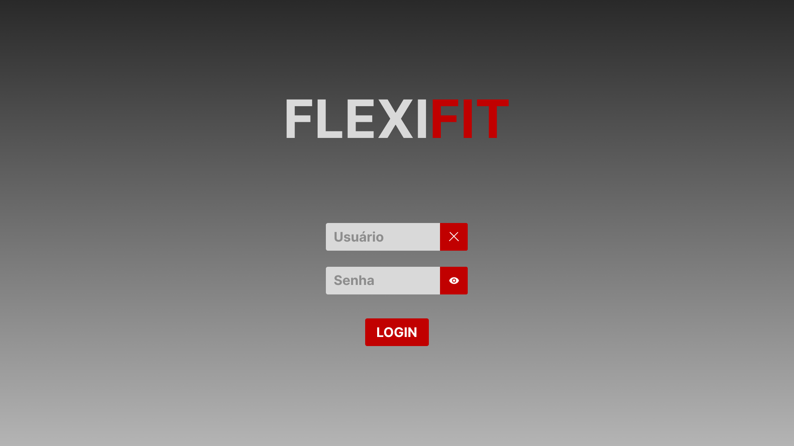
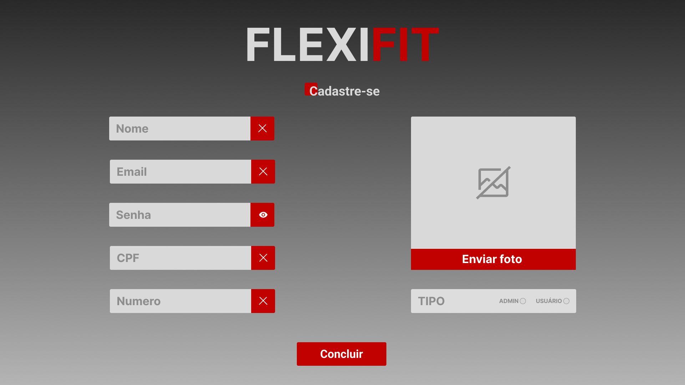
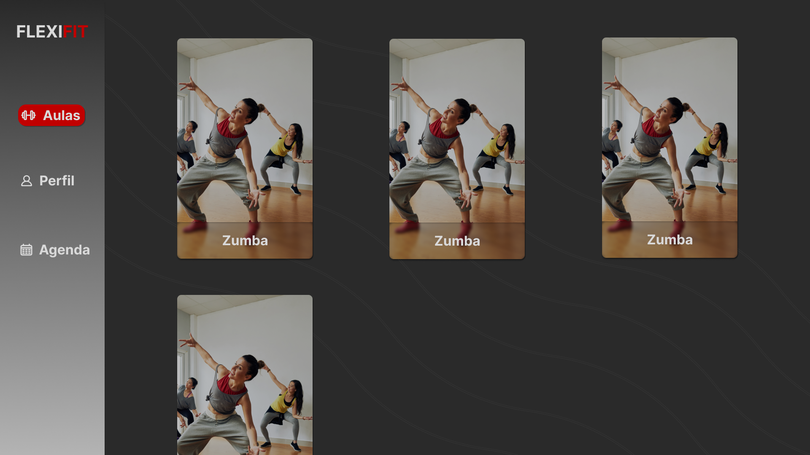
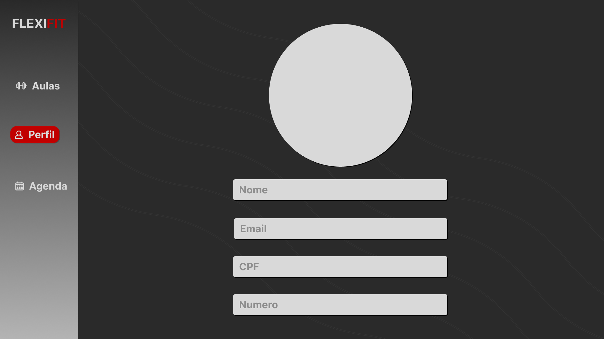
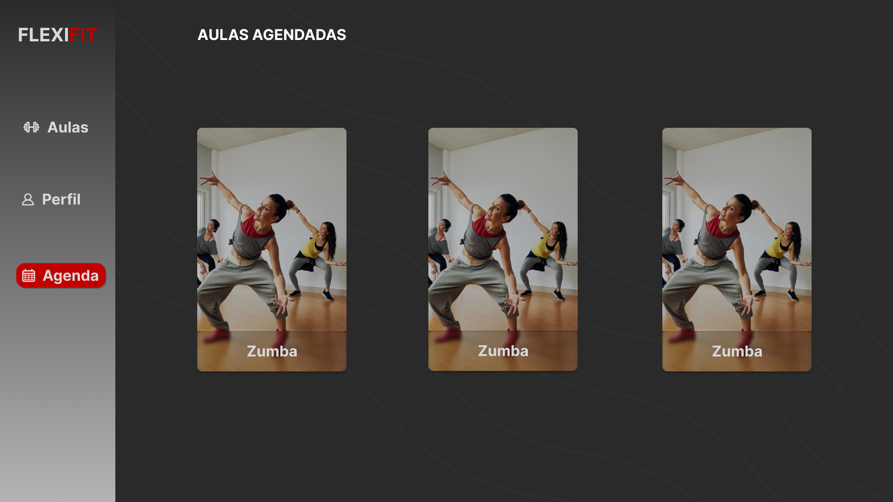

# Projeto de Interface

## User Flow

A figura abaixo mostra o fluxo completo da aplicação. Cada uma das telas será detalhada na seção de Protótipo de baixa fidelidade. Para visualizar o layout completo no figma clique [aqui](https://www.figma.com/file/wAKx1s0sbXuWETPymZyRJO/Untitled?type=design&node-id=0-1&mode=design&t=I73zVBhtf13wufHg-0).

<figure> 
    
    <figcaption>Figura 1 - Fluxo de telas do usuário
</figure> 

### Protótipo de baixa fidelidade

As telas do sistema apresentam uma estrutura comum que é apresentada na figura 2. Nesta estrutura existem 2 grandes blocos, descritos a seguir. Sendo eles:

<ul>
  <li>Side Nav - local onde estão dispostos o nome da aplicação web e navegação principal do site (menu da aplicação);</li>
  <li>Conteúdo - apresenta o conteúdo da tela em questão;</li>
</ul>

<figure> 
    
    <figcaption>Figura 1 -  Estrutura padrão do site
</figure> 

<h3><b>Tela – Login</b></h3>

A tela de Login apresenta campos para a inserção do e-mail e da senha.

<figure> 
  
  <figcaption>Figura 3 - Tela de Login
</figure> 

<h3><b>Tela – Cadastro</b></h3>

A tela de Login apresenta campos para o cadastro um novo usuário, como: nome, e-mail, senha, CPF, numero, foto, além de tipo Admin ou Usuário.

<figure> 
  
  <figcaption>Figura 4 - Tela de Cadastro
</figure> 

<h3><b>Tela – Aulas</b></h3>

Essa é a tela principal do sistema, nela vemos todas as aulas disponiveis no sistema.

<figure> 
  
  <figcaption>Figura 5 - Tela de Aulas
</figure> 

<h3><b>Tela – Aulas Tutor</b></h3>

Essa tela segue o mesmo padrão da tela anterior, mas esse tem a opção de cadastrar novas aulas.

<figure> 
  
  <figcaption>Figura 6 - Tela de Aulas Tutor
</figure> 

<h3><b>Tela – Perfil</b></h3>

Essa tela de perfil mostra os dados do usuário logado.

<figure> 
  
  <figcaption>Figura 7 - Tela de Perfil
</figure> 

<h3><b>Tela – Perfil Tutor</b></h3>

Assim como a tela anterior mostra os dados do usuário, mas essa por vez os dados são editáveis.

<figure> 
  
  <figcaption>Figura 8 - Tela de Perfil
</figure> 

<h3><b>Tela – Aulas Agendadas</b></h3>

Essa tela mostra todas as aulas agendadas pelo usuário.

<figure> 
  
  <figcaption>Figura 9 - Tela de Aulas Agendadas
</figure> 

<h3><b>Tela – Marca Aula</b></h3>

Essa tela se consistem um uma modal para agendar uma aula.

<figure> 
  
  <figcaption>Figura 10 - Tela de Marca Aulas
</figure> 

<h3><b>Tela – Adicionar Aula</b></h3>

Essa tela se consistem um uma modal para cadastrar uma nova aula, apenas para administradores.

<figure> 
  
  <figcaption>Figura 11 - Tela de Adicionar Aulas
</figure> 

<h3><b>Tela – Adicionar Aula</b></h3>

Essa tela é mostrada quando não existe nenhuma aula cadastrada no sistema.

<figure> 
  
  <figcaption>Figura 11 - Tela de Aulas Vazias
</figure> 

